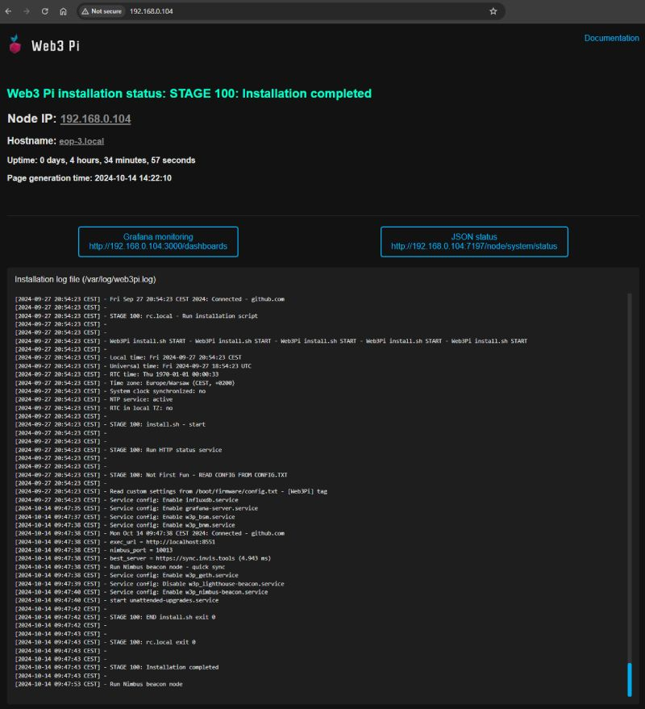

# Basic Status HTTP

This repository contains a Python program that runs as a service within the Web3 Pi image, providing installation status updates for Web3 Pi via a web interface on port 80.

  

## Overview

The **Basic Status HTTP** service is designed to display the installation status of the Web3 Pi system. It provides an easy way for users to verify the progress of the setup process using a web browser. The status page becomes available approximately three minutes after the device is first powered on.

### Features

- **Quick Installation Status Check**: Shows the current status of the Web3 Pi installation process in your browser.
- **Accessible via IP or Hostname**: The status page can be accessed through the device's IP address or via its hostname with the ".local" suffix (e.g., `http://eop-1.local`).
- **Runs on Port 80**: The service listens on port 80, making it accessible through standard HTTP requests.
- **Full Installation Log Visibility**: Displays the complete log of the installation process.
- **Direct Link to Grafana Monitoring**: Provides a direct link to the Grafana monitoring interface.
- **Device Information**: Displays the device's IP address, uptime, and hostname.

### Note

During the installation of Web3 Pi, the Raspberry Pi device may restart multiple times. As a result, the status page might occasionally become temporarily unavailable. Please be patient as the installation process completes.

## How to Access

1. Power on your Raspberry Pi with the Web3 Pi image.
2. Wait for approximately **3 minutes** after first boot to allow the status service to initialize.
3. Open a web browser and enter either the **IP address** of the Raspberry Pi or the **hostname** with ".local" suffix (e.g., `http://<IP_ADDRESS>` or `http://eop-1.local`).

The status page should now be visible, displaying the current state of the Web3 Pi installation.